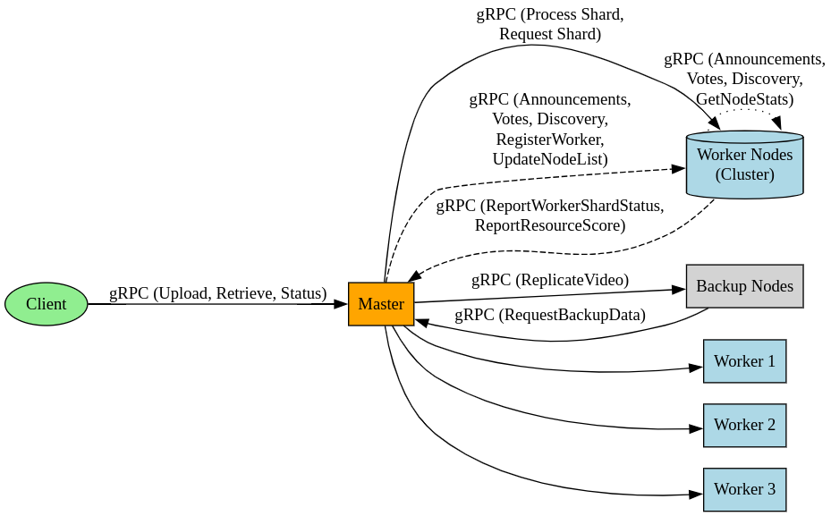

# Distributed Video Encoding System

This is a production-grade distributed video processing system with fault tolerance, leader election, and automatic scaling capabilities.

## Key Features

- **Fault-Tolerant Architecture**
    - Master failover with Raft-inspired leader election
    - Worker health monitoring and automatic task reassignment
    - Data replication to backup nodes
    - Automatic restoration from backups

- **Advanced Video Processing**
    - Dynamic resolution scaling (upscale/downscale)
    - Multi-format support (MP4, MKV, WebM, MOV)
    - Keyframe-aware video segmentation
    - Parallel shard processing with FFmpeg

- **System Intelligence**
    - Resource-aware load balancing using server scoring
    - Dynamic node discovery and registration
    - Real-time system metrics monitoring (CPU, memory, network)
    - Automatic node recovery and reconnection

- **Production-Ready Features**
    - gRPC streaming for large file transfers
    - Atomic file operations to prevent corruption
    - Graceful shutdown procedures
    - Comprehensive logging and status tracking

## System Architecture



## Prerequisites

- Python 3.9+
- FFmpeg 4.3+ with libx264
- MKVToolNix for container operations
- x264 codec libraries
- Disk space: Minimum 1GB free (SSD recommended)

## Quick Start

1. **Set Up Environment**

```

# Install system dependencies

sudo apt-get install -y ffmpeg mkvtoolnix libx264-dev

# Create and activate virtual environment

python -m venv venv
source venv/bin/activate

# Install Python dependencies

pip install grpcio protobuf grpcio-tools tqdm psutil ffmpeg-python
```

2. **Generate Protobuf Files**

```
python -m grpc_tools.protoc -I. --python_out=. --grpc_python_out=. replication.proto
```

3. **Create Test Video**

```
 create_test_video.sh  # Generates sample videos
```

## Running the System

### Start Master Node

```
 start_master.sh  # Default: localhost:50051
```

### Start Worker Nodes

```
 # Remove the backup-servers flag to run without backups, run each on a separated terminal or system
python node.py --role worker --host localhost --port 50061 --master localhost:50051 --backup-servers localhost:50061

python node.py --role worker --host localhost --port 50062 --master localhost:50051 --backup-servers localhost:50061

python node.py --role worker --host localhost --port 50063 --master localhost:50051 --backup-servers localhost:500614
```

## Client Operations

### Upload and Process Video

```
python client.py --master localhost:50051
  --upload ./test_video.mp4
  --width 640 --height 480
  --upscale-width 1920 --upscale-height 1080
  --format mkv
  --output ./processed.mkv
```

### Retrieve Processed Video

```
python client.py --master localhost:50051
  --retrieve <video_id>
  --output ./downloaded.mkv
```

### Check Processing Status

```
python client.py --master localhost:50051 --status <video_id>
```

### Advanced Options

| Parameter          | Description                                  | Default |
| ------------------ | -------------------------------------------- | ------- |
| `--poll-interval`  | Status check frequency (seconds)             | 5       |
| `--poll-timeout`   | Maximum processing wait time (seconds)       | 600     |
| `--upscale-width`  | Final output width override                  | -       |
| `--upscale-height` | Final output height override                 | -       |
| `--format`         | Output container format (mp4/mkv/webm/mov)   | mp4     |

## Helper Scripts

| Script                 | Purpose                                      |
| ---------------------- | -------------------------------------------- |
| `setup_env.sh`         | Full system setup and dependency install     |
| `start_master.sh`      | Launch master node with backup configuration |
| `start_worker.sh`      | Start 3 worker instances                     |
| `create_test_video.sh` | Generate test videos of various sizes        |
| `killscript.sh`        | Graceful system shutdown and cleanup         |

## Monitoring and Metrics

Metrics include:

- CPU/Memory utilization
- Network I/O
- Disk space
- Active tasks
- Election status
- Node scores

## Fault Tolerance Scenarios

1. **Master Failure**
      - Workers detect master timeout
      - Leader election initiated
      - New master restores from backups
      - Processing resumes automatically

2. **Worker Failure**
      - Master redistributes failed shards
      - Failed worker removed from pool
      - New workers automatically registered

3. **Network Partitions**
      - Majority quorum maintained
      - Split-brain prevention via term validation
      - Automatic reconciliation post-recovery

## Performance Considerations

- **Shard Size**: Optimal 10-second segments
- **Parallelism**: 3 workers recommended per 4-core CPU
- **Network**: 1Gbps+ recommended for HD content
- **Storage**: Separate disks for shards and final output

## License

Apache 2.0 - See [LICENSE](LICENSE) for details

---

# Note

For production deployments, modify the `start_*.sh` scripts to use actual IP addresses and configure firewall rules appropriately.
